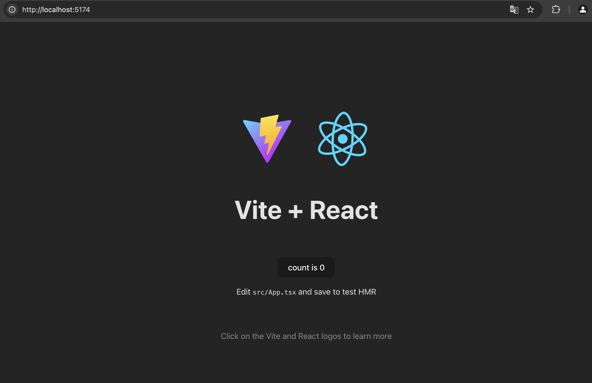
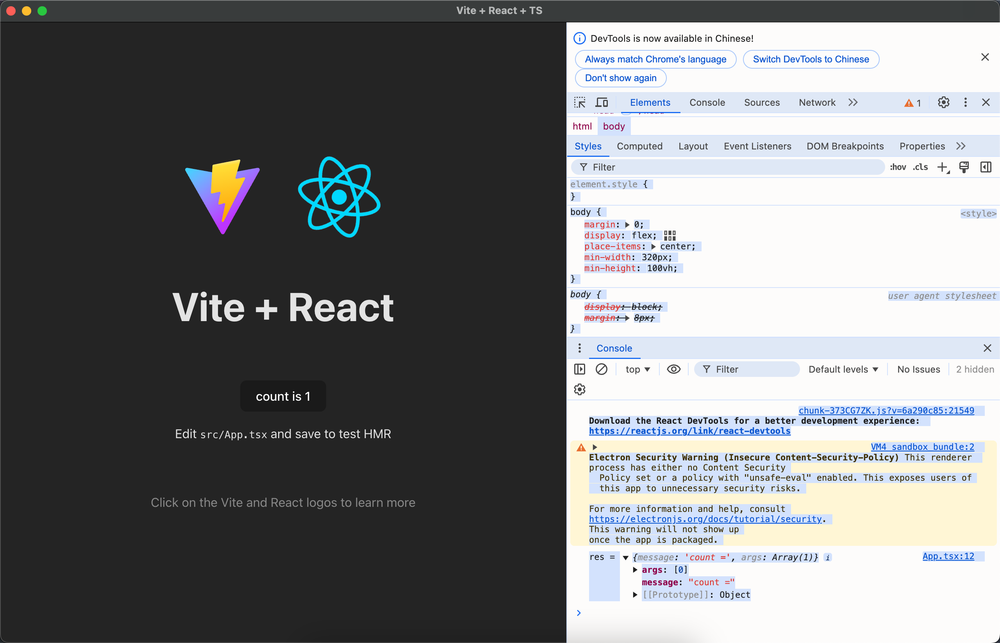

# Electron

## 简介

`Electron`（发音：[ɪˈlektrɑːn]）是基于`Node.js`<sup>[1]</sup>、`Chromium`<sup>[2]</sup>构建<u>跨平台的桌面应用<sup>[3]</sup></u>的框架。

此外，还可以将`Electorn`与现代前端开发框架，如`Vue.js`<sup>[4]</sup>、`React.js`<sup>[5]</sup>，以及UI库，如：`antd design`<sup>[6]</sup>、`element-ui`<sup>[7]</sup>，还有工程构建工具，如：`webpack`<sup>[8]</sup>、`vite`<sup>[9]</sup>进行结合，快速将`web`应用迁移成桌面应用。

当下一些热门应用，如：`Visual Stdio Code`、`Nation`、`Postman`，也是基于`Electron`构建的，可以访问[https://www.electronjs.org](https://www.electronjs.org)了解更多。

## 支持

- macOS
    - 支持64位Intel
    - Electron 11 支持Apple Silicon
- Windows
    - 支持 ia32(x86)
    - 支持 x64(amd64)
    - Electron 5.0.8 支持 ARM
    - Electron 23 移除支持 Windows 7/8/8.1
- Linux
    - Ubuntu 18.04 and newer
    - Fedora 32 and newer
    - Debian 10 and newer

## 搭建工程

示例基于`Vite` + `React` + `Electron`搭建。

### 创建项目

1. `yarn create vite`；

```bash
$ yarn create vite

yarn create v1.22.19
[1/4] 🔍  Resolving packages...
[2/4] 🚚  Fetching packages...
[3/4] 🔗  Linking dependencies...
[4/4] 🔨  Building fresh packages...

success Installed "create-vite@5.5.5" with binaries:
      - create-vite
      - cva
✔ Project name: … 
```

2. 输入项目名称；

```bash
✔ Project name: … vite-react-electron
? Select a framework: › - Use arrow-keys. Return to submit.
    Vanilla
    Vue
❯   React
    Preact
    Lit
    Svelte
    Solid
    Qwik
    Angular
    Others
```

3. 选择框架`React`;

```bash
✔ Project name: … vite-react-electron
? Select a framework: › - Use arrow-keys. Return to submit.
    Vanilla
    Vue
❯   React
    Preact
    Lit
    Svelte
    Solid
    Qwik
    Angular
    Others
```

4. 选择开发语言`TypeScript`;

```bash
✔ Project name: … vite-react-electron
✔ Select a framework: › React
? Select a variant: › - Use arrow-keys. Return to submit.
❯   TypeScript
    TypeScript + SWC
    JavaScript
    JavaScript + SWC
    Remix ↗
```

5. 完成创建。

```bash
✔ Project name: … vite-react-electron
✔ Select a framework: › React
✔ Select a variant: › TypeScript

Scaffolding project in /Users/weizuxiao/Documents/weizuxiao/learning-notes/electron/vite-react-electron...

Done. Now run:

  cd vite-react-electron
  yarn
  yarn dev

✨  Done in 110.24s.
```

6. 进入项目；

```bash
cd vite-react-electron
yarn
yarn dev
```

8. 等待完成；

```bash
yarn install v1.22.19
info No lockfile found.
[1/4] 🔍  Resolving packages...
[2/4] 🚚  Fetching packages...
[3/4] 🔗  Linking dependencies...
[4/4] 🔨  Building fresh packages...
success Saved lockfile.
✨  Done in 35.37s.
yarn run v1.22.19
$ vite
Port 5173 is in use, trying another one...

  VITE v5.4.11  ready in 424 ms

  ➜  Local:   http://localhost:5174/
  ➜  Network: use --host to expose
  ➜  press h + enter to show help
```

9. 访问演示。



### 安装依赖

1. 添加`concurrently`、`electron`、`cross-env`；
```bash
yarn add concurrently electron cross-env -D
```

```bash
yarn add v1.22.19
[1/4] 🔍  Resolving packages...
warning electron > @electron/get > global-agent > boolean@3.2.0: Package no longer supported. Contact Support at https://www.npmjs.com/support for more info.
warning electron > @electron/get > global-agent > roarr > boolean@3.2.0: Package no longer supported. Contact Support at https://www.npmjs.com/support for more info.
[2/4] 🚚  Fetching packages...
[3/4] 🔗  Linking dependencies...
[4/4] 🔨  Building fresh packages...
success Saved lockfile.
success Saved 77 new dependencies.
info Direct dependencies
├─ concurrently@9.1.0
├─ cross-env@7.0.3
└─ electron@33.2.0
info All dependencies
├─ @electron/get@2.0.3
├─ @sindresorhus/is@4.6.0
├─ @szmarczak/http-timer@4.0.6
├─ @types/cacheable-request@6.0.3
├─ @types/http-cache-semantics@4.0.4
├─ @types/keyv@3.1.4
├─ @types/yauzl@2.10.3
├─ ansi-regex@5.0.1
├─ buffer-crc32@0.2.13
├─ cacheable-lookup@5.0.4
├─ cacheable-request@7.0.4
├─ cliui@8.0.1
├─ clone-response@1.0.3
├─ concurrently@9.1.0
├─ cross-env@7.0.3
├─ decompress-response@6.0.0
├─ defer-to-connect@2.0.1
├─ define-data-property@1.1.4
├─ define-properties@1.2.1
├─ detect-node@2.1.0
├─ electron@33.2.0
├─ emoji-regex@8.0.0
├─ end-of-stream@1.4.4
├─ env-paths@2.2.1
├─ es6-error@4.1.1
├─ extract-zip@2.0.1
├─ fd-slicer@1.1.0
├─ fs-extra@8.1.0
├─ get-caller-file@2.0.5
├─ get-intrinsic@1.2.4
├─ global-agent@3.0.0
├─ globalthis@1.0.4
├─ got@11.8.6
├─ graceful-fs@4.2.11
├─ has-property-descriptors@1.0.2
├─ has-proto@1.0.3
├─ has-symbols@1.0.3
├─ hasown@2.0.2
├─ http-cache-semantics@4.1.1
├─ http2-wrapper@1.0.3
├─ is-fullwidth-code-point@3.0.0
├─ json-stringify-safe@5.0.1
├─ jsonfile@4.0.0
├─ lodash@4.17.21
├─ matcher@3.0.0
├─ mimic-response@3.1.0
├─ normalize-url@6.1.0
├─ object-keys@1.1.1
├─ once@1.4.0
├─ p-cancelable@2.1.1
├─ pend@1.2.0
├─ progress@2.0.3
├─ pump@3.0.2
├─ quick-lru@5.1.1
├─ require-directory@2.1.1
├─ resolve-alpn@1.2.1
├─ roarr@2.15.4
├─ rxjs@7.8.1
├─ semver-compare@1.0.0
├─ serialize-error@7.0.1
├─ shell-quote@1.8.1
├─ sprintf-js@1.1.3
├─ string-width@4.2.3
├─ strip-ansi@6.0.1
├─ sumchecker@3.0.1
├─ supports-color@8.1.1
├─ tree-kill@1.2.2
├─ tslib@2.8.1
├─ type-fest@0.13.1
├─ undici-types@6.19.8
├─ universalify@0.1.2
├─ wrap-ansi@7.0.0
├─ wrappy@1.0.2
├─ y18n@5.0.8
├─ yargs-parser@21.1.1
├─ yargs@17.7.2
└─ yauzl@2.10.0
✨  Done in 4.16s.
```

2. 添加打包工具；

```bash
yarn add @electron-forge/cli -D
```

```bash
yarn add v1.22.19
[1/4] 🔍  Resolving packages...
warning @electron-forge/cli > @electron-forge/core > @electron/packager > @electron/asar > glob@7.2.3: Glob versions prior to v9 are no longer supported
warning @electron-forge/cli > @electron-forge/core > @electron/packager > @electron/asar > glob > inflight@1.0.6: This module is not supported, and leaks memory. Do not use it. Check out lru-cache if you want a good and tested way to coalesce async requests by a key value, which is much more comprehensive and powerful.
warning @electron-forge/cli > @electron-forge/core > @electron/rebuild > @electron/node-gyp > glob@8.1.0: Glob versions prior to v9 are no longer supported
warning @electron-forge/cli > @electron-forge/core > @electron/rebuild > @electron/node-gyp > glob > inflight@1.0.6: This module is not supported, and leaks memory. Do not use it. Check out lru-cache if you want a good and tested way to coalesce async requests by a key value, which is much more comprehensive and powerful.
warning @electron-forge/cli > @electron-forge/core > @electron/rebuild > @electron/node-gyp > make-fetch-happen > cacache > glob@8.1.0: Glob versions prior to v9 are no longer supported
warning @electron-forge/cli > @electron-forge/core > @electron/rebuild > @electron/node-gyp > make-fetch-happen > cacache > @npmcli/move-file@2.0.1: This functionality has been moved to @npmcli/fs
warning @electron-forge/cli > @electron-forge/core > @electron/rebuild > @electron/node-gyp > make-fetch-happen > cacache > rimraf@3.0.2: Rimraf versions prior to v4 are no longer supported
warning @electron-forge/cli > @electron-forge/core > @electron/rebuild > @electron/node-gyp > make-fetch-happen > cacache > @npmcli/move-file > rimraf@3.0.2: Rimraf versions prior to v4 are no longer supported
warning @electron-forge/cli > @electron-forge/core > @electron/rebuild > @electron/node-gyp > make-fetch-happen > cacache > rimraf > glob@7.2.3: Glob versions prior to v9 are no longer supported
[2/4] 🚚  Fetching packages...
[3/4] 🔗  Linking dependencies...
[4/4] 🔨  Building fresh packages...
success Saved lockfile.
success Saved 161 new dependencies.
info Direct dependencies
└─ @electron-forge/cli@7.5.0
info All dependencies
├─ @electron-forge/cli@7.5.0
├─ @electron-forge/core-utils@7.5.0
├─ @electron-forge/core@7.5.0
├─ @electron-forge/maker-base@7.5.0
├─ @electron-forge/plugin-base@7.5.0
├─ @electron-forge/publisher-base@7.5.0
├─ @electron-forge/template-vite-typescript@7.5.0
├─ @electron-forge/template-vite@7.5.0
├─ @electron-forge/template-webpack-typescript@7.5.0
├─ @electron-forge/template-webpack@7.5.0
├─ @electron/asar@3.2.17
├─ @electron/node-gyp@10.2.0-electron.1
├─ @electron/notarize@2.5.0
├─ @electron/osx-sign@1.3.1
├─ @electron/universal@2.0.1
├─ @electron/windows-sign@1.2.0
├─ @gar/promisify@1.1.3
├─ @npmcli/fs@2.1.2
├─ @npmcli/move-file@2.0.1
├─ @tootallnate/once@2.0.0
├─ @xmldom/xmldom@0.8.10
├─ abbrev@1.1.1
├─ agent-base@6.0.2
├─ agentkeepalive@4.5.0
├─ aggregate-error@3.1.0
├─ ansi-escapes@5.0.0
├─ at-least-node@1.0.0
├─ author-regex@1.0.0
├─ base64-js@1.5.1
├─ bl@4.1.0
├─ bluebird@3.7.2
├─ buffer-from@1.1.2
├─ buffer@5.7.1
├─ cacache@16.1.3
├─ chrome-trace-event@1.0.4
├─ clean-stack@2.2.0
├─ cli-cursor@4.0.0
├─ cli-spinners@2.9.2
├─ cli-truncate@3.1.0
├─ clone@1.0.4
├─ colorette@2.0.20
├─ commander@4.1.1
├─ compare-version@0.1.2
├─ cross-dirname@0.1.0
├─ defaults@1.0.4
├─ detect-libc@2.0.3
├─ dir-compare@4.2.0
├─ eastasianwidth@0.2.0
├─ encoding@0.1.13
├─ err-code@2.0.3
├─ error-ex@1.3.2
├─ eventemitter3@5.0.1
├─ execa@1.0.0
├─ expand-tilde@2.0.2
├─ exponential-backoff@3.1.1
├─ filename-reserved-regex@2.0.0
├─ flora-colossus@2.0.0
├─ fs-minipass@2.1.0
├─ galactus@1.0.0
├─ get-installed-path@2.1.1
├─ get-package-info@1.0.0
├─ glob@7.2.3
├─ global-modules@1.0.0
├─ global-prefix@1.0.2
├─ hosted-git-info@2.8.9
├─ http-proxy-agent@5.0.0
├─ https-proxy-agent@5.0.1
├─ humanize-ms@1.2.1
├─ iconv-lite@0.6.3
├─ ieee754@1.2.1
├─ indent-string@4.0.0
├─ infer-owner@1.0.4
├─ ini@1.3.8
├─ interpret@3.1.1
├─ ip-address@9.0.5
├─ is-arrayish@0.2.1
├─ is-core-module@2.15.1
├─ is-interactive@1.0.0
├─ is-lambda@1.0.1
├─ is-stream@1.1.0
├─ isbinaryfile@4.0.10
├─ jsbn@1.1.0
├─ junk@3.1.0
├─ load-json-file@2.0.0
├─ lodash.get@4.4.2
├─ log-symbols@4.1.0
├─ log-update@5.0.1
├─ make-fetch-happen@10.2.1
├─ map-age-cleaner@0.1.3
├─ mem@4.3.0
├─ mimic-fn@2.1.0
├─ minimist@1.2.8
├─ minipass-fetch@2.1.2
├─ minipass-sized@1.0.3
├─ minizlib@2.1.2
├─ negotiator@0.6.4
├─ nice-try@1.0.5
├─ node-abi@3.71.0
├─ node-api-version@0.2.0
├─ node-fetch@2.7.0
├─ nopt@6.0.0
├─ normalize-package-data@2.5.0
├─ npm-run-path@2.0.2
├─ ora@5.4.1
├─ p-defer@1.0.0
├─ p-finally@1.0.0
├─ p-is-promise@2.1.0
├─ p-map@4.0.0
├─ p-try@2.2.0
├─ parse-author@2.0.0
├─ parse-json@2.2.0
├─ parse-passwd@1.0.0
├─ path-is-absolute@1.0.1
├─ path-key@2.0.1
├─ path-parse@1.0.7
├─ path-type@2.0.0
├─ pe-library@1.0.1
├─ pkg-dir@4.2.0
├─ plist@3.1.0
├─ postject@1.0.0-alpha.6
├─ proc-log@2.0.1
├─ promise-inflight@1.0.1
├─ read-binary-file-arch@1.0.6
├─ read-pkg-up@2.0.0
├─ read-pkg@2.0.0
├─ readable-stream@3.6.2
├─ rechoir@0.8.0
├─ resedit@2.0.3
├─ resolve-dir@1.0.1
├─ resolve-package@1.0.1
├─ resolve@1.22.8
├─ restore-cursor@4.0.0
├─ retry@0.12.0
├─ rfdc@1.4.1
├─ safe-buffer@5.2.1
├─ safer-buffer@2.1.2
├─ smart-buffer@4.2.0
├─ socks-proxy-agent@7.0.0
├─ socks@2.8.3
├─ source-map-support@0.5.21
├─ source-map@0.6.1
├─ spdx-correct@3.2.0
├─ spdx-exceptions@2.5.0
├─ string_decoder@1.3.0
├─ strip-bom@3.0.0
├─ strip-eof@1.0.0
├─ strip-outer@1.0.1
├─ sudo-prompt@9.2.1
├─ supports-preserve-symlinks-flag@1.0.0
├─ tar@6.2.1
├─ tr46@0.0.3
├─ trim-repeated@1.0.0
├─ unique-filename@2.0.1
├─ unique-slug@3.0.0
├─ util-deprecate@1.0.2
├─ validate-npm-package-license@3.0.4
├─ wcwidth@1.0.1
├─ webidl-conversions@3.0.1
├─ whatwg-url@5.0.0
├─ wrap-ansi@8.1.0
└─ xmlbuilder@15.1.1
✨  Done in 6.96s.
```

3. 引入项目；

```bash
npx electron-forge import
```

```bash
✔ Checking your system
✔ Locating importable project
✔ Processing configuration and dependencies
  ✔ Installing dependencies
  ✔ Copying base template Forge configuration
  ✔ Fixing .gitignore
✔ Finalizing import

› We have attempted to convert your app to be in a format that Electron Forge understands.
  Thanks for using Electron Forge!
```

4. 修改`package.json`文件，大体如下；

```json
{
  "name": "vite-react-electron",
  "main": "app/index.js",
  "version": "0.0.1",
  "license": "MIT",
  "scripts": {
    "dev": "concurrently -k \"vite\" \"\" ",
    "build": "tsc -b && vite build",
    "lint": "eslint .",
    "preview": "vite preview",
    "start": "electron-forge start",
    "package": "electron-forge package",
    "make": "electron-forge make"
  },
}
```

5. 根目录下创建`app`目录；

```bash
mkdir app
```

6. 在`app`目录下添加electron进程文件`index.js`

```js
const path = require('path')
const { app, BrowserWindow } = require('electron')
require('./ipcmain.js')

if (require('electron-squirrel-startup')) {
    app.quit()
}

const createWindow = async () => {
    const options = {
        width: 1280,
        height: 960,
        webPreferences: {
            partition: String(new Date().getTime()),
            webSecurity: true,
            nodeIntegration: false,
            enableRemoteModule: true,
            preload: path.join(__dirname, 'preload.js'),
        }
    }
    const mainWindow = new BrowserWindow(options)
    if (!app?.isPackaged) {
        mainWindow.loadURL('http://localhost:5173')
        mainWindow.webContents.openDevTools()
    } else {
        mainWindow.loadFile(path.join(__dirname, '../dist', 'index.html'))
    }
    
}

app.whenReady().then(async () => {
    await createWindow()
    app.on('activate', async () => {
        if (BrowserWindow.getAllWindows().length === 0) {
           await createWindow()
        }
    })
})

app.on('window-all-closed', function () {
    if (process.platform !== 'darwin') {
        app.quit()
    }
})
```

7. 在`app`目录添加IPC通信`ipcmain.js`和`preload.js`

```js ipcmain.js
const { ipcMain, } = require('electron')

// 示例
ipcMain.on('test', async (event, id, message, ...args) => {
    try {
        event.sender.send(`test-${id}-success`, { message, args})
    } catch (error) {
        event.sender.send(`test-${id}-failed`, error?.message)
    }
})

// 自定义更多处理方法

```

```js preload.js
const { contextBridge, ipcRenderer } = require("electron")

// 上下文桥接器
contextBridge.exposeInMainWorld('electron', {

    async: (method, ...args) => {
        // 给每个请求加个唯一id
        const id = crypto.randomUUID().toString()?.replaceAll(/-/g, '')
        ipcRenderer.send(method, id, ...args)
        // 转成异步，并定义响应格式
        return new Promise((resovle, reject) => {
            ipcRenderer.once(`${method}-${id}-success`, (_, response) => {
                resovle(response)
            })
            ipcRenderer.once(`${method}-${id}-failed`, (_, error) => {
                reject(error)
            })
        })
    }
    
})
```

8. 修改`src/App.tsx`添加演示代码；

```tsx
import { useState } from 'react'
import reactLogo from './assets/react.svg'
import viteLogo from '/vite.svg'
import './App.css'

function App() {
    const [count, setCount] = useState(0)

    const onClick = async () => {
        setCount(() => count + 1)
        const data = await window.electron.async('test', 'count =', count)
        console.log(`res =`, data)
    }

    return (
        <>
            <div>
                <a href="https://vite.dev" target="_blank">
                    
                </a>
                <a href="https://react.dev" target="_blank">
                    
                </a>
            </div>
            <h1>Vite + React</h1>
            <div className="card">
                <button onClick={onClick}>
                    count is {count}
                </button>
                <p>
                    Edit <code>src/App.tsx</code> and save to test HMR
                </p>
            </div>
            <p className="read-the-docs">
                Click on the Vite and React logos to learn more
            </p>
        </>
    )
}

export default App

```

9. 处理`Eslint`提示：类型“Window & typeof globalThis”上不存在属性“electron”。

```ts 
/*
 * 在`src`目录下新增electron.d.ts
 */


// electron.d.ts
export interface IElectronAPI {
    // 定义你的API方法
    // eslint-disable-next-line @typescript-eslint/no-explicit-any
    async: (...args: any[]) => Promise<any>;
}

declare global {
    interface Window {
        electron: IElectronAPI;
    }
}

```

10. 运行应用;

```bash
yarn run dev
```

```bash

> vite-react-electron@0.0.1 dev
> concurrently -k "vite" "npm run electron:dev"

[0] The CJS build of Vite's Node API is deprecated. See https://vite.dev/guide/troubleshooting.html#vite-cjs-node-api-deprecated for more details.
[0] 
[0]   VITE v5.4.11  ready in 93 ms
[0] 
[0]   ➜  Local:   http://localhost:5173/
[0]   ➜  Network: use --host to expose
[1] 
[1] > vite-react-electron@0.0.1 electron:dev
[1] > electron-forge start
[1] 
[1] ❯ Checking your system
[1] ❯ Checking git exists
[1] ❯ Checking node version
[1] ❯ Checking packageManager version
[1] ✔ Found node@20.11.0
[1] ✔ Found git@Git-146)
[1] ✔ Found yarn@1.22.19
[1] ✔ Checking your system
[1] ❯ Locating application
[1] ✔ Locating application
[1] ❯ Loading configuration
[1] ✔ Loading configuration
[1] ❯ Preparing native dependencies
[1] ✔ Preparing native dependencies
[1] ❯ Running generateAssets hook
[1] ✔ Running generateAssets hook
[1] 
[1] [54637:1125/191014.483861:ERROR:CONSOLE(1)] "Unknown VE context: language-mismatch    at new He (devtools://devtools/bundled/ui/legacy/legacy.js:1:98356)
[1]     at devtools://devtools/bundled/ui/legacy/legacy.js:1:191793
[1]     at new oi (devtools://devtools/bundled/ui/legacy/legacy.js:1:192189)
[1]     at oi.instance (devtools://devtools/bundled/ui/legacy/legacy.js:1:192311)
[1]     at O.presentUI (devtools://devtools/bundled/panels/emulation/emulation.js:1:58454)
[1]     at #I (devtools://devtools/bundled/entrypoints/main/main.js:1:17314)
[1]     at #x (devtools://devtools/bundled/entrypoints/main/main.js:1:17109)", source: devtools://devtools/bundled/ui/visual_logging/visual_logging.js (1)
[1] [54637:1125/191014.616075:ERROR:CONSOLE(1)] "Request Autofill.enable failed. {"code":-32601,"message":"'Autofill.enable' wasn't found"}", source: devtools://devtools/bundled/core/protocol_client/protocol_client.js (1)
[1] [54637:1125/191014.616101:ERROR:CONSOLE(1)] "Request Autofill.setAddresses failed. {"code":-32601,"message":"'Autofill.setAddresses' wasn't found"}", source: devtools://devtools/bundled/core/protocol_client/protocol_client.js (1)
```



11. 修改`vite.config.ts`，追加`base`

```ts
export default defineConfig({
  plugins: [react()],
  base: '/'
})
```

12. 编译打包。

```bash
# 编译
yarn run build
```

```bash
yarn run v1.22.19
$ vite build
The CJS build of Vite's Node API is deprecated. See https://vite.dev/guide/troubleshooting.html#vite-cjs-node-api-deprecated for more details.
vite v5.4.11 building for production...
✓ 34 modules transformed.
dist/index.html                   0.46 kB │ gzip:  0.30 kB
dist/assets/react-CHdo91hT.svg    4.13 kB │ gzip:  2.05 kB
dist/assets/index-n_ryQ3BS.css    1.39 kB │ gzip:  0.71 kB
dist/assets/index-C3rNgknK.js   143.29 kB │ gzip: 46.11 kB
✓ built in 360ms
✨  Done in 3.62s.
```

```bash
# 打包
yarn run package
```

```bash
yarn run v1.22.19
$ electron-forge package
✔ Checking your system
✔ Preparing to package application
✔ Running packaging hooks
  ✔ Running generateAssets hook
  ✔ Running prePackage hook
✔ Packaging application
  ✔ Packaging for arm64 on darwin [4s]
✔ Running postPackage hook
✨  Done in 5.39s.
```
